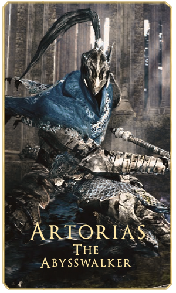

<!DOCTYPE html>
<html lang="pt-br">
<head>
    <meta charset="UTF-8">
    <meta http-equiv="X-UA-Compatible" content="IE=edge">
    <meta name="viewport" content="width=device-width, initial-scale=1.0">
    <link rel="stylesheet" href="CSS/style.css">
    <title>Dark Souls</title>
</head>
<body class="bg">

    <blank id="topo">    
    

        <ul id="menu">
            
            <map name="ds">
                <area alt="Dark Souls" href="#" coords="14,18,489,117" shape="rect">
            </map>
            <li><a href="#">Início</a></li>
            <li><a href="#historia">História</a></li>
            <li><a href="#bosses">Bosses</a></li>
            <li><a href="#contato">Contato</a></li>
        </ul>
    

    

    

        <video autoplay muted loop>
            <source src="IMG/ds vid.mp4" type="video/mp4">
        </video>
        

                   
        

    

    

    <blank id="historia">
    
    

        <h1 id="hist">História</h1>
         
        

            O mundo de Dark Souls é um mundo de ciclos. Reinos sobem e descem, eras vêm e vão,
            e até mesmo o tempo pode terminar e reiniciar conforme a chama se apaga e é renovada.
            Esses ciclos estão ligados à Primeira Chama, uma manifestação misteriosa de vida que
            divide e define estados separados, como calor e frio, ou vida e morte. Conforme a Primeira
            Chama desaparece, essas diferenças também começam a desaparecer, como a vida e a morte 
            tendo pouca distinção e os humanos se tornando mortos-vivos. O início de uma Idade das Trevas, 
            o momento em que a Primeira Chama morreu totalmente, é marcado por noites intermináveis, vida
            selvagem desenfreada, tempo, espaço e realidade quebrando, terras colapsando e convergindo
            umas para as outras, pessoas transformando-se em monstros, escuridão cobrindo o mundo, e os
            Deuses perdendo seu poder. Para evitar isso e prolongar a Era do Fogo, o portador de uma alma
            poderosa deve "ligar-se" à Primeira Chama, tornando-se o combustível para outra era. Se isso
            não for feito, a Primeira Chama acabará morrendo e uma Idade das Trevas começará.
        

    

    

    

    <blank id="bosses">
        

            

               <h1>Bosses</h1>
            

            

            

                
            

            

                
Artorias era um dos 4 cavaleiros de Gwyn, os cavaleiros comandantes do exercito
                   de Lorde Gwyn. Ele tinha uma vontade de aço inimaginável, tanto que o ajudava, 
                   quanto alimentava seu ódio pelos servos da escuridão, particularmente os 
                   Espectros das Trevas de Kaathe.

            

            

            

            

                
            

            

                
Sif foi companheiro de Artorias, mas ele foi engolido pelo Abismo a onde Artorias sacrificou seu escudo
                   para protege-lo, com isso ele quebrou seu braço direito, vendo que ele não podia protege-lo Artorias 
                   o teleportou de lá. Agora, Sif guarda o túmulo de seu camarada caído e seu anel do abismo, para garantir que o que 
                   aconteceu com Artorias, não aconteça com mais ninguém.

            

             
        

            

                
            

            

                
Ornstein era um dos cavaleiros de maior confiança de Lorde Gwyn, que também era leal ao Primogênito de Lorde Gwyn. 
                   Considerado o capitão dos Quatro Cavaleiros de Gwyn, ele recebeu uma alma especial e um anel do Senhor da Luz do Sol.
                   Em algum momento, Ornstein deixou a catedral em busca do Rei Sem Nome. Não está claro como Ornstein sobreviveu à batalha 
                   contra o Chosen Undead, mas parece que ele finalmente encontrou o caminho para o Pico do Archdragon. No entanto, os resultados
                   de sua busca, bem como o próprio destino de Ornstein, permanecem desconhecidos.

            

             
            

                
            

            

                
Um dos Quatro Cavaleiros de Gwyn e o único membro feminino do grupo, Ciaran destrói os inimigos de Gwyn por meio de assassinato e 
                   subterfúgio. Ciaran aparece após a derrota de Artorias, pedindo ao jogador a Alma de Artorias. Ela recompensa o jogador com o 
                   Gold Tracer e o Dark Silver Tracer se receber a Alma de Artorias. É possível que ela estivesse romanticamente envolvida com Artorias, 
                   antes que ele se perdesse para o Abismo.

            

            

                
            

            

                
Hawkeye Gough já foi um dos quatro cavaleiros de Gwyn e líder dos Greatarchers e Dragonslayers, mas agora está cego e preso, 
                   sem propósito. Ele passa o tempo meditando filosoficamente enquanto faz esculturas em arco-árvore, preenchendo-as com sua voz, 
                   que é liberada quando quebrada. Ele é o portador original do Hawk Ring, e aquele que pretendia usá-lo.

            

        
        

    

    

    <blank id="contato">
    

        

            <h1 id="cont">Contato</h1>
        <form action="#">
            <label for="nome"></label>
                <input type="text" autocomplete="on" id="nome" name="nome" size="40" minlength="8" maxlength="32" placeholder="Digite o seu Nome."/>
                <input type="text" autocomplete="on" id="nome" name="nome" size="40" minlength="8" maxlength="32" placeholder="Digite o seu Sobrenome."/>
                  
                <input type="text" autocomplete="on" id="nome" name="nome" size="40" maxlength="32" placeholder="Digite o seu Email."/>
                <input type="text" autocomplete="on" id="nome" name="nome" size="40" maxlength="32" placeholder="Digite o seu Numero."/>
                  
                <input type="text" autocomplete="on" id="nome" name="nome" size="85" maxlength="32" placeholder="Assunto da Mensagem."/>
                  
                <label for="comentario"></label>
                <textarea placeholder="Digite sua mensagem." id="nome" name="comentario" id="comentario" rows="25" cols="87"></textarea>
                 
                <input type="submit" value=" Enviar ">
                <input type="reset" value=" Limpar ">
        
       
        </form>
    
    

    

    

        
        
         <ul id="st">
             <li class="rodabg"><a id="style" href="#topo">Voltar ao Topo.</a></li>
             
@All rights reserved.

         </ul> 
     

</body>
</html>
        
        
        

        
 *{
    margin: 0 auto;
    padding: 0;
    box-sizing: border-box;
}

@font-face {
    src: url("../Fonts/Trajan\ Pro.ttf");
    font-family: "Trajan";
    font-size: normal;
}

@font-face{
    src: url("../Fonts/KaiseiOpti-Regular.ttf");
    font-family: "Prince";
    font-size: normal;
}

.hr{
    background: rgb(252,204,70);
    background: linear-gradient(90deg, rgba(252,204,70,1) 0%, rgba(255,235,178,1) 51%, rgba(252,204,70,1) 100%);
    border: none;
}

.bg{
    background-image: url("../IMG/bg.jpg");
    background-attachment: fixed;
    background-repeat: no-repeat;
    background-size: cover;
    height: 100%;
    margin: 0; 
}

#menu{
    list-style: none;
    width: 100%;
    background-color: rgb(26, 26, 26);
}

#menu li{
    display: inline;
}

#menu li a{
    color: rgb(245, 233, 218);
    text-decoration: none;
    display: inline;
    padding: 15px;
    display: inline-block;
    font-family: "Trajan";

}

#menu li a:hover{
    background-color: rgb(95, 26, 16);
}

.banner{
    width: 100%;
    height: 100%;
    overflow: hidden;
    display: flex;
    justify-content: center;
    align-items: center;
}

.banner video{
    position: relative;
    display: flex;
    left: 0;
    object-fit: cover;
    width: 100%;
    height: 5%;
}

.banner .logo{
    position: absolute;
    z-index: 1;
    align-items: center;
}

.boss .title{
    position: absolute;
    margin-top: 8%;
    margin-left: 45%;
    font-family: "Trajan";
    color: rgb(248, 222, 142);
    text-shadow: 2px 2px 4px rgb(32, 32, 32);
}

.boss .art{
    position: absolute;
    margin-top: 15%;
    margin-left: 13%;
}

.boss .arto{
    text-indent: 2%;
    position: absolute;
    text-align: justify;
    color: white;
    margin-top: 20%;
    margin-right: 50%;
    left: 30%;
    font-family: "Prince";
}

.boss .sif{
    position: absolute;
    margin-top: 15%;
    margin-left: 52%;
}

.boss .si{
    text-indent: 4%;
    position: absolute;
    text-align: justify;
    color: white;
    margin-top: 16%;
    margin-right: 13%;
    left: 69%;
    margin-bottom: 10%;
    font-family: "Prince";
}

.boss .orn{
    position: absolute;
    margin-top: 45%;
    margin-left: 13%;
}

.boss .or{
    text-indent: 4%;
    position: absolute;
    text-align: justify;
    color: white;
    margin-top: 53%;
    margin-right: 13%;
    left: 30%;
    margin-bottom: 10%;
    font-family: "Prince";
}

.boss .ciaran{
    position: absolute;
    margin-top: 75%;
    margin-left: 13%;
}

.boss .cia{
    text-indent: 4%;
    position: absolute;
    text-align: justify;
    color: white;
    margin-top: 76%;
    margin-right: 50%;
    left: 30%;
    margin-bottom: 10%;
    font-family: "Prince";
}

.boss .gough{
    position: absolute;
    margin-top: 75%;
    margin-left: 52%;
}

.boss .gou{
    text-indent: 5%;
    position: absolute;
    text-align: justify;
    color: white;
    margin-top: 76%;
    margin-right: 13%;
    left: 69%;
    margin-bottom: 10%;
    font-family: "Prince";
}

.con{
    margin-left: 25%;
    position: absolute;
}

#hist{
    text-align: justify;
    position: relative;
    font-family: "Trajan";
    color: rgb(248, 222, 142);
    margin-top: 15%;
    margin-right: 34%;
    left: 25%;
    text-shadow: 2px 2px 4px rgb(32, 32, 32);
}

#text{
    display: flex;
    text-align: justify;
    text-indent: 2%;
    font-family: "Prince";
    position: relative;
    margin-right: 28%;
    left: 8%;
    color: rgb(255, 255, 255);
}

#ch{
    margin-top: 5%;
    margin-left: 5%;
    margin-bottom: 5%;
}

#night{
    width: 100%;
    height: 1500px;
    margin-top: -2.7%;
    margin-bottom: -0.3%;
}

#nome{
    font-family: Arial, Helvetica, sans-serif;
}

#cont {
    text-align: justify;
    position: relative;
    font-family: "Trajan";
    color: rgb(248, 222, 142);
    margin-top: 5%;
    margin-right: 34%;
    left: 37%;
    margin-bottom: 5%;
    text-shadow: 2px 2px 4px rgb(32, 32, 32);
}

#contbg{
    width: 100%;
    height: 650px;
    margin-bottom: -0.3%;
}

#pub{
    margin-top: 2%;
    margin-left: 5%;
    margin-bottom: 1%;
    width: 250px;
}

#adv{
    margin-top: 1%;
    margin-right: 5%;
    margin-bottom: 1%;
    width: 80px;
}

#st{
    width: 100%;
    height: 150px;
    background-color: rgb(26, 26, 26);
}

#st li{
    display: inline;
}

#st li a{
    color: rgb(245, 233, 218);
    text-decoration: none;
    display: inline;
    padding: 15px;
    display: inline-block;
    font-family: "Trajan";
    margin-left: 20%;
    margin-top: 3%;
}

#rights{
    margin-left: 47%;
    margin-top: -1%;
    font-family: Arial, Helvetica, sans-serif;
    color: rgb(168, 168, 168);
    font-size: 10px;
}
